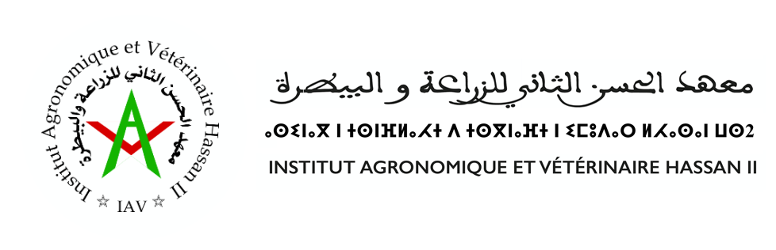

# ARTIFICAL-MAP
<a name="readme-top"></a>
[![Contributors][contributors-shield]][contributors-url]
[![Forks][forks-shield]][forks-url]
[![Stargazers][stars-shield]][stars-url]
[![Issues][issues-shield]][issues-url]
[![MIT License][license-shield]][license-url]
[![LinkedIn][linkedin-shield]][linkedin-url]

<!-- logo-->
<br />
<div align="center">
  <a href="#">
    
  </a>

  <h3 align="center">Application Of Ai On Solar Energy</h3>

  <p align="center">
    prediction of diffirent posible postion of solar energy using a professional map
    <br />
    <a href="https://github.com/bouslama-hamza"><strong>Explore the docs</strong></a>
    <br />
    <br />
  </p>
</div>

<!-- ABOUT THE PROJECT -->
## About The Project

<!-- text about the real time prediction -->
Is it possible to use the Nowaday AI technologie and apply it into the world of renewable energy to make is easier to predict the best possible postion (with some more additional information), to make this filed upgrading into the next level to the future ? we have the answer to this question because today and using the technologie of deep learning , its now possible
<br>
<div align="center">
<a href="#">
    
  </a>
</div>
<br>

with the implimentation of a simple interface map and the AI world , we make it possbile to use a simple dashboard interface to make a hug prediction about that , with more implementation of graph , visualisation geographique position and more .
<p align="right">(<a href="#readme-top">back to top</a>)</p>

## Guid Of Use
<br>
<div align="center">
<a href="#">
    
  </a>
</div>
<br>
To make it more easier for people to use , we made a page of Guide , in a simple way people need to have a simple look on those pdf so they can have a powerful idea about the perfomance and advantages of our app , more information can be found inside the app.

## Additional Applications
<div align="center">
<a href="#">
    
  </a>
</div>
<br>

the application havs being created using Django frame work and the star if our party , with more additional fonctionalti with leaflet.js that helped a lot in the implimentation of the map user .

## Built In Technologie
There are numerous technologies employed in this project's final product, taking into account design, back-end, front-end, and more, but we may concentrate on the most crucial one as the following.

* [![Django][Django.com]][Django-url]
* [![Bootstrap][Bootstrap.com]][Bootstrap-url]
* [![JQuery][JQuery.com]][JQuery-url]

<p align="right">(<a href="#readme-top">back to top</a>)</p>


<!-- GETTING STARTED -->
## Getting Started

_The project's concept may seem a little sophisticated, but the steps for getting started are quite simpler. We may summarize them as follows.._

1. Make sure that connection is really istablished
2. Clone the repo
   ```
   git clone https://github.com/bouslama-hamza/ARTIFICAL-MAP.git
   ```

3. Go To the Real Time Series Folder
   ```
   cd ARTIFICAL-MAP/
   ```
   
4. Launch the server
   ```
    python manage.py runserver
   ``` 

<p align="right">(<a href="#readme-top">back to top</a>)</p>


<!-- CONTRIBUTING -->
## Contributing

Contributions are what make the open source community such an amazing place to learn, inspire, and create. Any contributions you make are **greatly appreciated**.

<p align="right">(<a href="#readme-top">back to top</a>)</p>


<!-- CONTACT -->
## Contact

Hamza Bouslama - [Hamza:Gmail](ham.bousa98@gmail.com)

Project Link: [https://github.com/bouslama-hamza/BRAIN_TUMOR](https://github.com/bouslama-hamza/BRAIN_TUMOR)

<p align="right">(<a href="#readme-top">back to top</a>)</p>

<!-- MARKDOWN LINKS & IMAGES -->
<!-- https://www.markdownguide.org/basic-syntax/#reference-style-links -->
[contributors-shield]: https://img.shields.io/github/contributors/othneildrew/Best-README-Template.svg?style=for-the-badge
[contributors-url]: https://github.com/othneildrew/Best-README-Template/graphs/contributors
[forks-shield]: https://img.shields.io/github/forks/othneildrew/Best-README-Template.svg?style=for-the-badge
[forks-url]: https://github.com/othneildrew/Best-README-Template/network/members
[stars-shield]: https://img.shields.io/github/stars/othneildrew/Best-README-Template.svg?style=for-the-badge
[stars-url]: https://github.com/othneildrew/Best-README-Template/stargazers
[issues-shield]: https://img.shields.io/github/issues/othneildrew/Best-README-Template.svg?style=for-the-badge
[issues-url]: https://github.com/othneildrew/Best-README-Template/issues
[license-shield]: https://img.shields.io/github/license/othneildrew/Best-README-Template.svg?style=for-the-badge
[license-url]: https://github.com/othneildrew/Best-README-Template/blob/master/LICENSE.txt
[linkedin-shield]: https://img.shields.io/badge/-LinkedIn-black.svg?style=for-the-badge&logo=linkedin&colorB=555
[linkedin-url]: https://linkedin.com/in/hamza-bouslama
[Bootstrap.com]: https://img.shields.io/badge/Bootstrap-563D7C?style=for-the-badge&logo=bootstrap&logoColor=white
[Bootstrap-url]: https://getbootstrap.com
[JQuery.com]: https://img.shields.io/badge/jQuery-0769AD?style=for-the-badge&logo=jquery&logoColor=white
[JQuery-url]: https://jquery.com 
[Django.com]:https://img.shields.io/badge/Django-0769AD?style=for-the-badge&logo=django&logoColor=white
[Django-url]:https://www.djangoproject.com/